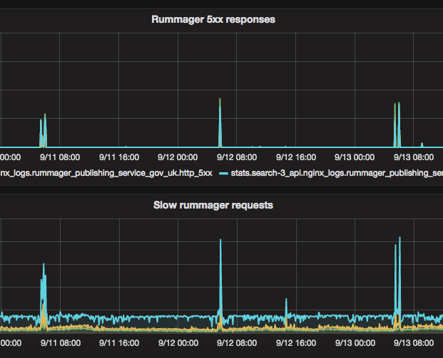
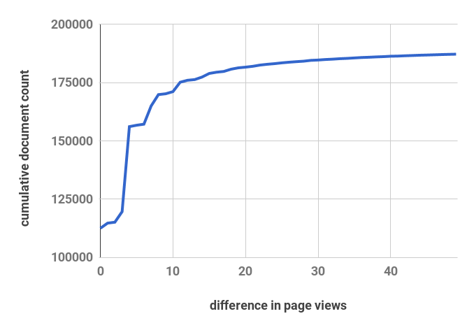

# Decision record: Bulk load data into empty indexes again

Date: 2017-09-15

## Context

In [perform popularity updating without using an index lock](doc/arch/adr-003-popularity-updating-without-index-locks.md) we changed the process
for bulk loading data into Rummager's search indexes. The main reason we bulk load
data is to update the popularity field every night, which affects every document in the search index.

Previously we'd used a separate search index to write into, and locked the existing index
for writes until the process completed. Then we'd switch the read alias to the new index.

We decided to change this to update the existing index in place, which removed
the need for locking. Although the task usually runs overnight, we wanted to minimise the time we locked the index for, so we could run it in the day if necessary. We used sidekiq to distribute bulk index requests over multiple workers.

## Problem

After switching to the new index, we observed regular spikes in 503 errors from the search API, that coincide with when the nightly task runs. The elasticsearch queries are taking longer than normal and timing out. We therefore want to revisit the implementation of this nightly task, so that reads from the index are unaffected by bulk indexing.

We investigated some [performance tuning options](https://www.elastic.co/guide/en/elasticsearch/guide/current/indexing-performance.html), but they didn't solve the
immediate problem.

## Rejected solutions

### Update less data

The `page-traffic` index contains today's analytics data, and is updated nightly. The number of page views a link has over a 14 day period is stored in its `vc_14` field, and the rank relative to other pages on GOV.UK is stored in the `rank_14` field.

We considered limiting the popularity update task so that it only changed
a small number of documents. We compared the `vc_14` field in the page traffic
over two successive days to work out how much page popularity shifts in practice.

A very small number number of pages actually have significant changes day to day
(i.e, a change of at least +/- 10 page views). This means that we shouldn't need
to update the entire search index every day - we could get away with 10% of the current update workload.

However, rummager doesn't use the `vc_14` values in its search queries; it uses `rank_14`. When we update the popularity field in the search indexes, we derive it from the `rank_14` value in `page-traffic`. This means that at update time, the data we actually have available to compare is the previous day's popularity and the current popularity (derived from rank).

The `rank_14` value changes a lot more day to day than `vc_14`, since small differences in page views of a single document can shift a lot of other documents up and down. We're not confident that if we only update the 10% of content whose rank has changed the most, we could keep rummager's data reflecting the actual distribution of pageviews.

We considered also storing `vc_14` in the search index, but retaining `popularity` as well. We could then see if the change in `vc_14` meets a threshold before updating popularity. We rejected this too, because it means that when a document becomes more popular, we would still neglect to update the rank of documents it overtakes. Also, for documents that aren't viewed often, we would introduce a bias towards older content, because the the rank a new document starts with when it has no pageviews is equal to the current size of the index, and the popularity is derived from this.

It may be better to change rummager to use `vc_14` directly for its popularity boost, which would let us do partial popularity updates. This is a bigger change than we want to make right now, as it would need careful measurement to ensure we don't break queries.

### Insert into a new index and the old index at the same time

Elasticsearch lets you create aliases that point to multiple indexes. We thought we could use this to continue to writing to the old index while building a new one. We could then switch over to the new index at a later time, and we wouldn't have to lock anything. Unfortunately it turns out that this is [not technically possible](https://github.com/elastic/elasticsearch/issues/6240), and it would be complicated to implement at the application level.

### Insert into a new index, while reading from the old one, without locking

We could use a separate write alias to redirect all writes to a fresh index
while it is being built. The read index would miss new updates while this process was running, so this has the same impact as using write locks, except that we
are able to process the writes immediately instead of letting them back up on
a sidekiq queue.

The downside here is that if the new process fails we have no way to recover the new (non reindex) writes.

## Decision

Instead of inserting into the current index in-place, we will go back to locking the index and inserting into a fresh index.

This makes the popularity update the same as the `migrate_schema` task.

## Consequences

By reintroducing the write lock, we won't be able to run this task during working hours, without blocking indexing.
